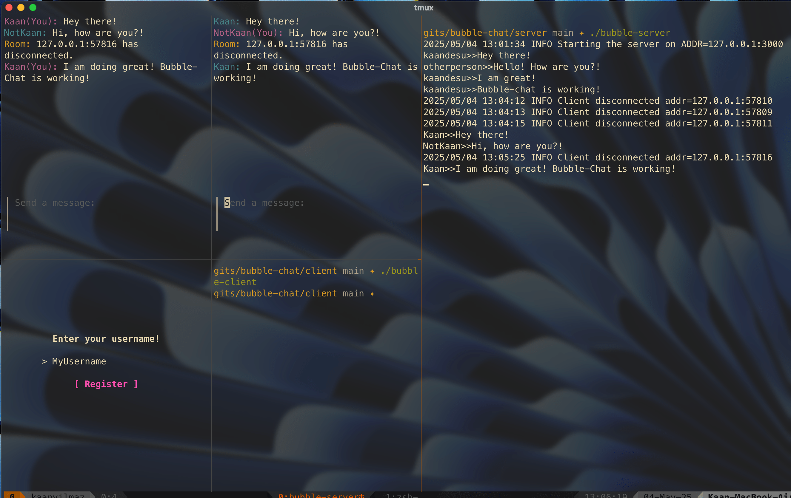

## Bubble Chat

**Bubble Chat** is a terminal-based (TUI) chat application that allows users to join chat rooms and communicate over a TCP connection.
<br>
Made with [bubbletea](http://github.com/charmbracelet/bubbletea/).

<div align="center">
  <a href="https://github.com/kaandesu/bubble-chat">
    
  </a>
</div>

#### 1. Start the Server

1. Navigate to the `server/` directory:

   ```bash
   cd server
   go run .
   ```

The server will run on `localhost:3000`.

#### 2. Start the Client

1. Navigate to the `server/` directory:

   ```bash
   cd client
   go run .
   ```

The client will attempt to connect to the server running on localhost:3000. Follow the prompts to join the chat room and start chatting!

### Contributing

All contributions are welcome! You can start by creating an issue.

### License

**Deck Crawler** is licensed under the [GNU General Public License v3.0](LICENSE.md).

### Contact

For questions or feedback, reach out with an issue or a discussion!
